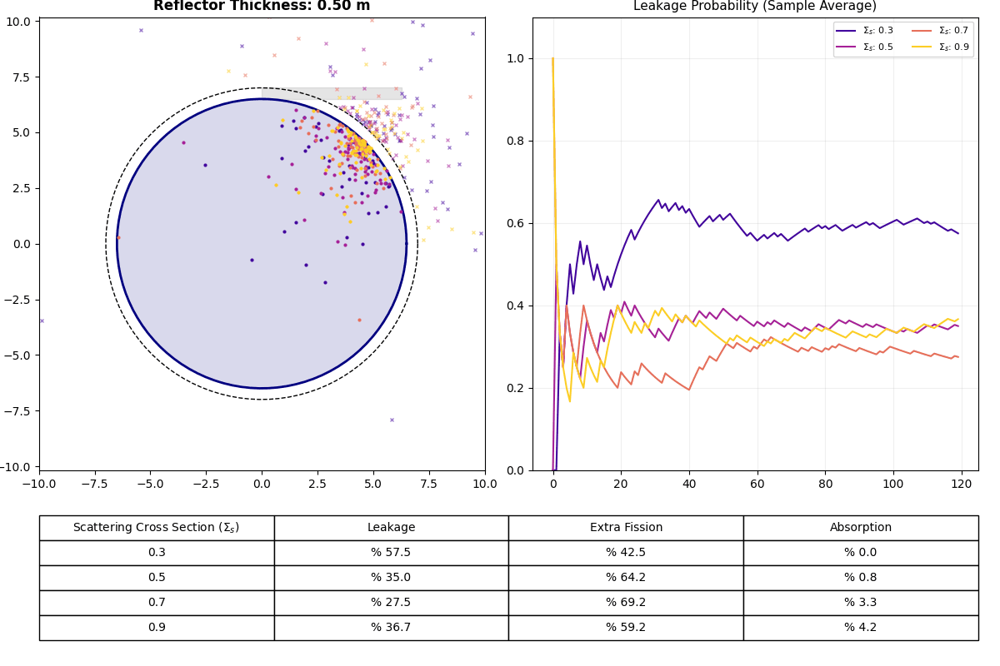

# NeutronFlow – Monte Carlo Reactor Simulation

A physics-based Monte Carlo simulation of neutron transport in a simplified nuclear reactor geometry.

## 🔬 Overview

This project models neutron behavior inside a reactor core and reflector system using stochastic Monte Carlo methods. It simulates:

- Neutron scattering
- Absorption in reflector and core
- Fission events
- Neutron leakage
- Statistical convergence of leakage probability

The system dynamically visualizes how reflector thickness affects neutron leakage and reaction probabilities.

## 🧠 Physics Model

The simulation is based on simplified neutron transport assumptions:

- Random free path sampling using exponential distribution
- Probabilistic interaction model:
  - Absorption probability (pA)
  - Fission probability (pF)
- Region-based cross section switching (core vs reflector)
- 2D radial reactor geometry

## 📊 Features

- Real-time Monte Carlo neutron tracking
- Animated reactor geometry evolution
- Leakage probability convergence plot
- Statistical output table per simulation frame
- GIF export for visualization

## 🛠️ Tech Stack

- Python 3
- NumPy
- Matplotlib
- Pillow (GIF export)

## 📁 Output

- `neutron_physics.gif` → animated simulation result

## 🚀 How to Run

```bash
pip install numpy matplotlib pillow
python NeutronFlow.py
```
## References:
J. R. Lamarsh - Introduction to nuclear reactor theory - Addison-Wesley
J. B. Davison and B. Sykes - Neutron transport theory - 1958
G. I. Bell and S. Glasston - Nuclear reactor theory - 1970
